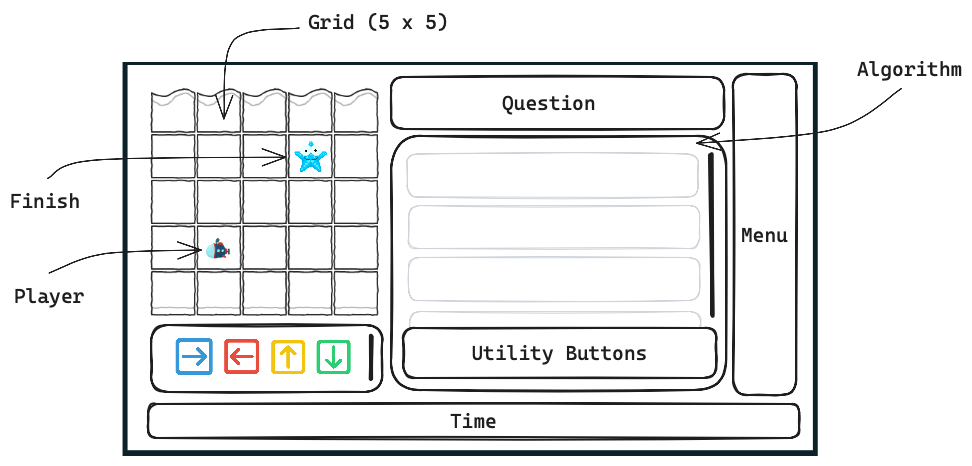

# Development Logs

This document is for personal use to keep track of the steps / decisions taken during this project.

## Setup

I chose to go with the following:

- [Visual Studio Code](https://code.visualstudio.com/) as the _code editor_
  - VS Code is highly popular and consequently has a large number of extensions available (e.g., prettier for code formatting)
  - Integration with Github Copilot
  - Other code editors are said to be more lightweight, but so far I have not encountered any performance issues.
- [Node.js](https://nodejs.org/en/) as the JavaScript _package manager_
  - In the first tutorials I followed, Node.js was used. I have not explored other package managers such as Yarn.
- [Vite](https://vitejs.dev/) as the _bundler_
  - Vite is a bundler that is specifically designed for development. It is said to be faster than Webpack and Rollup
  - I initially started with `webpack` as the bundler, but ran into the issue that the latest versions of `kaboom.js` (v. 3000.1.0+) could not be bundled correctly for display in DuckDuckGo. This issue was resolved by downgrading versions of `kaboom.js` - but ultimately I needed newer functions.
  - We chose `vite` over other bundlers because of its easy setup and recommendation by other developers who use `kaboom.js`.
- [Typescript](https://www.typescriptlang.org/) as the _superset of JavaScript_
  - Typescript adds type annotations to JavaScript. This is useful for larger projects to ensure that the code is correct.
  - Typescript is also recommended by `kaboom.js` and is used in the tutorials.
  - I'm not fully understanding it just yet, but it definitely helps during development to ensure you are passing the appropriate values to parameters/functions.
- [Kaboom.js](https://kaboomjs.com/) as the _2D game framework_
  - First of all, a game framework - when sufficiently lightweight - is preferred over vanilla JS because it provides a lot of functionality out of the box. I tried a range of frameworks such as `kaboom.js`, `pixi.js`, and `Phaser3`.
  - I ultimately found that `kaboom.js` was most beginner friendly, had good documentation, is actively maintained, requires the fewest (none) dependencies, and can easily be extended with vanilla JS.

### NPM: Manage Packages

To initialize our project, run the following command from the console in your project's root directory:

```bash
npm create vite@latest .
```

This will prompt a series of questions (e.g., the name and author of the project) which you can fill in or leave empty.
You now have the basic setup of `vite` / `npm`. You will see, among other things a `package.json` file that contains the information just provided. This file will be updated in subsequent steps to include information about the dependencies we install. The `package.json` file is akin to using `renv` in R and `venv` in Python - it can be used to restore the project correctly when sharing the code with others.

### Vite

We need to bundle the code into smaller files that are suited for loading/displaying in the browser. `Vite` is the framework that will do this for us - which uses pre-configured `rollup` configurations. To finish our configuration use

```bash
npm install
```

#### Dependencies

When you initially configure the development environment, the relevant dependencies need to be installed. To see which dependencies we utilized see the `package.json` file.

In this file we distinguish between _development dependencies_ and _production dependencies_. The development dependencies are only used during development (e.g., to bundle the code) and are not required to run the code in production.

If you want to add a dependency for _development_ you use the `--save-dev` flag:

```bash
npm install npm-run-all --save-dev
```

If you want to add a dependency for _production_ you use the `--save` flag:

```bash
npm install kaboom --save
```

We use the following dependencies for development:

- npm-run-all: a package to run multiple scripts in parallel (for more convenient development commands)
- typescript: a superset of JavaScript that adds type annotations
- vite-plugin-top-level-await: a plugin to enable top-level await in vite (otherwise throws errors when trying to wait for assets to load).

After installing the dependencies you now will also have a `node_modules` directory which contains files for the installed dependencies.
_note_: there is no need to commit the `node_modules` directory to version control - the packages/versions are already version controlled elsewhere! It should already be added to the provided `.gitignore` file.

#### Configuration

The only changes to the default `vite` configuration are the await plugin in the `vite.config.ts` file and the addition of the `npm-run-all` scripts in the `package.json` file.

## Kaboom.js: 2D Game Framework

### Context

We have refrained from loading `kaboom` as a global variable/context. This is because it becomes difficult to read the code and determine which functions belong to `kaboom`, `Vanilla JS` or future other frameworks. This was suggested in the following [tutorial](https://youtu.be/pVAmEJqK-3A)

# Tricks / Sources

- Use `await` functions to ensure that, for example the map.json file, is fully loaded before continuing.
- Cannot use `hex` colors together with k contexts (https://youtu.be/pVAmEJqK-3A)
- How to use `Tiled` together with Kaboom (https://youtu.be/pVAmEJqK-3A)

# Assets

Downloaded assets from [Olga's Lab](https://www.olgaslab.com/graphics/viewgraphic.php/2D-Huge-underwater-themed-bundle/w1f4h8d7/). The assets are available for commercial use. The assets come in individual `.png` files and were combined to spritesheets using [Texturepacker](https://www.codeandweb.com/texturepacker/download/7.1.0/mac-64). Please note that there are many more animation frames than strictly necessary. For example, the submarine was reduced from 30 frames to 8.

# Pseudo Implementation



## User Interface

The User Interface was based of Rekentuin's UI. The general dimensions of the game (1000, 550) will prove useful regardless of the environment in which the game is launched. However, Rekentuin has some UI elements which already take up the screen. These are the sidebar menu (right) and the display of time/coins (bottom). The remaining components of our game have to account for this 'lost' space.

We currently fill the entire screen with different UI components. It's important to note that these will consider the 'outer' borders, actual elements will have to be placed within the containers. For easier computations all positions are determined from the top-left corner.

The elements are mapped out in the `params.js` file and can be visualized on screen with the `showUI()` function.

## Styling

We want a basic styling to show where the game is located on the screen. We don't use a fullscreen setup so that it will be easier / more logical to add other elements to the page (e.g., a menu, etc.).

- [x] Ensure the game is shown in the middle of the screen
- [x] Visualize where the game context is (e.g., with a background color)
- [x] Use custom font (because it is a canvas element this cannot be done through `css` styling)
- [ ] Uniform sizes of sprites (e.g., 64 x 64)
- [ ] Combine all assets (world tiles, player) to a spritesheet

## World

The `player` will move in a 'world' that consists of a fixed size grid.

- [x] Add general background to canvas (to show where grid ends)
- [x] Load the actual tiles as Sprites
- [x] Add the tiles as a grid to the canvas (e.g., 5 x 5)
- [ ] Add boundaries so that a player would not be able to fall/move off grid
- [ ] Make the start/finish positions variable to 'item' information.

## Player

We start of with a boat, this doesn't really require any elaborate animations - though we want this to be added in the future.

- [x] Load the player sprite (boat)
- [x] Add the player to the canvas
- [x] Add a basic animation
- [x] Add the player to the correct place on the grid
- [ ] Prevent the player from moving off grid

## Finish

We start of with an animated starfish.

- [x] Load the finish sprite (starfish)
- [x] Add finish to grid
- [x] Add basic animation (idle)

## Buttons

- [x] Load buttons as sprites
- [ ] Add buttons to the canvas (e.g., to move the player)
- [ ] Show 'code' editor

# Resources

- [Fixing type error issues in Typescript with querySelector](https://bobbyhadz.com/blog/typescript-queryselector)
